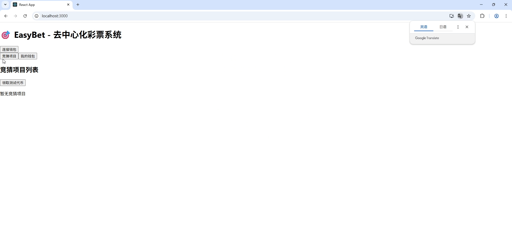
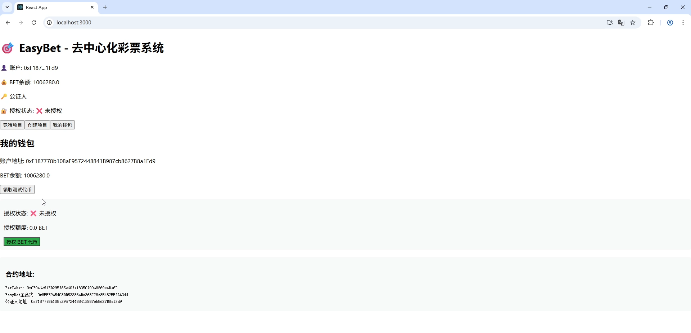
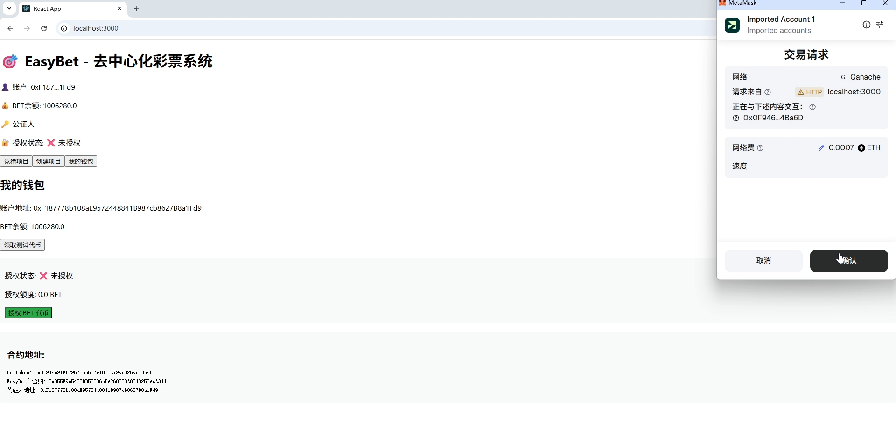
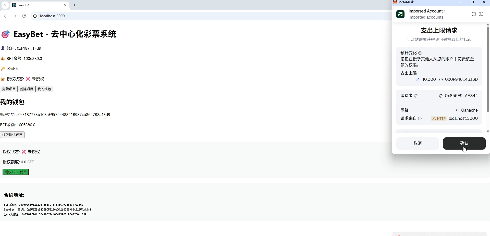
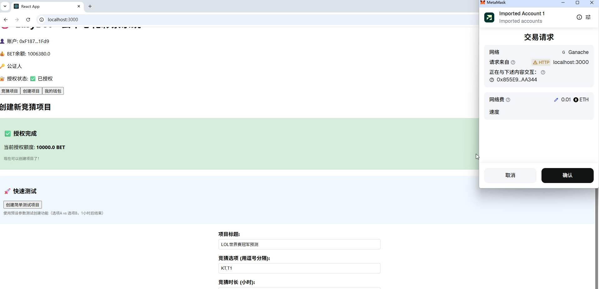
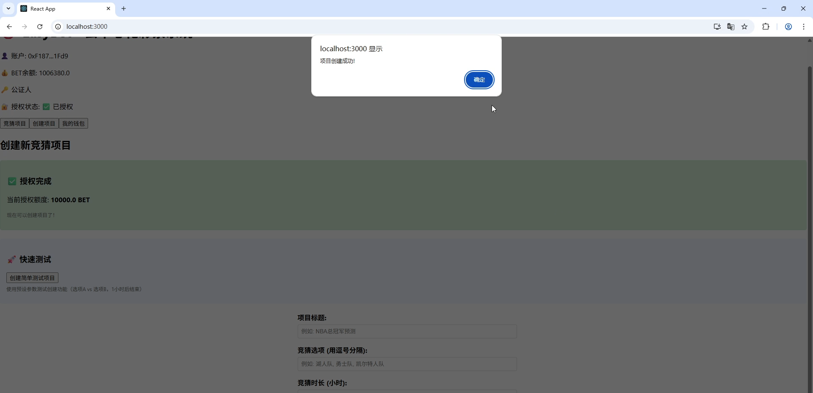
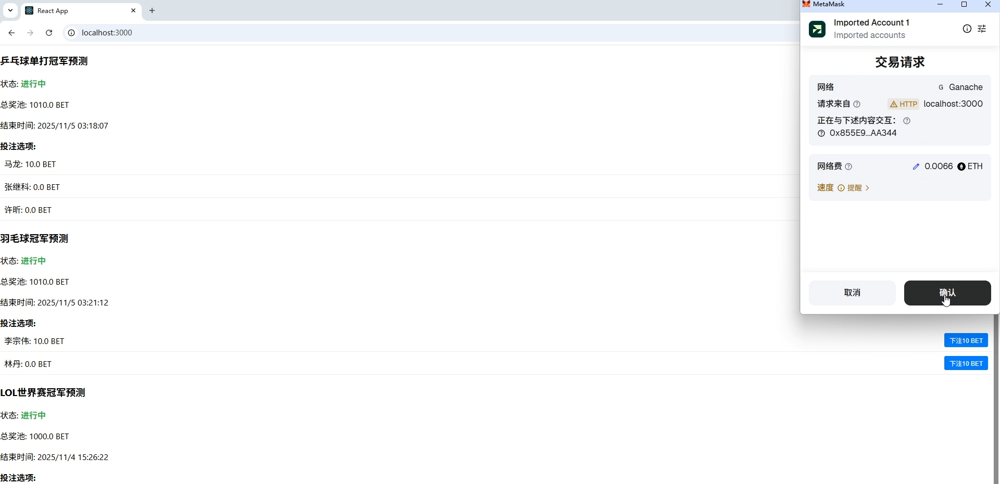
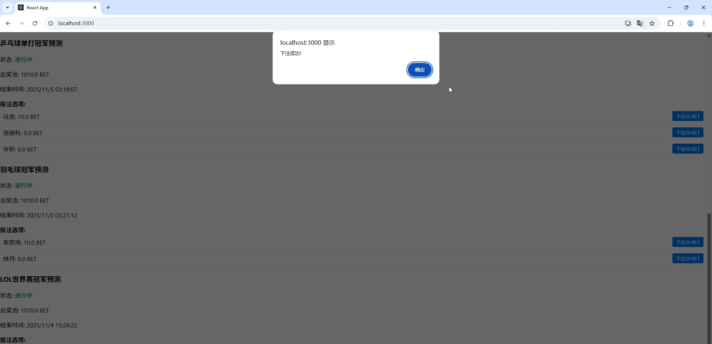

# ZJU-blockchain-homework2
=======
# EasyBet - 进阶去中心化彩票系统

## 项目简介
EasyBet 是一个基于区块链的进阶去中心化彩票系统，支持体育赛事、娱乐节目等各类竞猜项目的创建、参与和交易。系统实现了彩票的自由买卖功能，让玩家可以根据市场变化灵活调整投资策略。

## 如何运行
### 环境要求
补充如何完整运行你的应用。

Node.js 16+

Ganache GUI 或 Ganache CLI

MetaMask 钱包插件

#### 启动本地区块链

使用 Ganache GUI:

下载并安装 Ganache

创建新工作区，设置端口为 7545

链ID设置为 1337

启动本地区块链网络

或使用 Ganache CLI:

npm install -g ganache-cli

ganache-cli -p 7545 -d

#### 部署智能合约

进入合约目录
cd contracts

安装依赖
npm install

编译合约
npx hardhat compile

部署到Ganache
npx hardhat run scripts/deploy.ts --network ganache

部署成功后，记录输出的合约地址。

#### 配置前端应用

进入前端目录
cd frontend

安装依赖
npm install

启动开发服务器
npm start

访问 http://localhost:3000 即可使用应用。

#### 配置 MetaMask 钱包
添加 Ganache 网络：

网络名称: Ganache

RPC URL: http://127.0.0.1:7545

链ID: 1337

货币符号: ETH

导入测试账户：

从 Ganache 界面复制第一个账户的私钥

在 MetaMask 中导入账户（这个账户将作为公证人）

更新合约地址：
将部署得到的合约地址更新到 frontend/src/config/contracts.ts 文件中。

## 功能实现分析

### 基础功能实现
ERC20 积分系统 

实现 BetToken.sol ERC20 合约

用户可通过水龙头领取测试代币

所有下注和交易使用 BET 代币进行

ERC721 彩票凭证

实现 BetNFT.sol ERC721 合约

每个下注生成唯一的 NFT 彩票凭证

彩票包含项目ID、选项ID、下注金额等信息

竞猜项目管理

公证人可创建多选项竞猜项目

设置项目标题、选项、结束时间

公证人提供初始奖池资金

彩票购买机制

玩家选择选项并下注 BET 代币

系统自动铸造对应 NFT 彩票

实时更新项目奖池信息

### 进阶功能实现
链上订单簿系统 

实现完整的挂单买卖机制

玩家可指定价格挂单出售彩票

其他玩家可按挂单价格购买

实时显示活跃订单信息

彩票交易功能

支持 ERC721 委托交易

玩家可在结果公布前自由买卖彩票

完整的授权和转账安全机制

项目结算系统

公证人在截止时间后公布结果

系统自动计算获胜者并分配奖池

获胜者按比例平分总奖池

### 技术实现细节
智能合约架构: 采用三合约设计，职责分离

权限管理: 公证人特权机制，确保系统安全

状态管理: 完整的项目生命周期状态跟踪

事件系统: 完善的区块链事件记录和前端监听

## 项目运行截图

进入网页

查看账户余额

领取测试代币

授权创建项目

请求创建项目

成功创建项目

请求参与竞猜

成功参与竞猜

## 参考内容

课程Demo参考: blockchain-course-demos

OpenZeppelin合约: 使用 "@openzeppelin/contracts": "^5.0.0" 实现 ERC20 和 ERC721

Hardhat开发框架: 用于合约编译、测试和部署

Ethers.js: 前端与区块链交互的核心库

React + TypeScript: 前端开发技术栈

## 项目特点
完整的彩票生命周期管理

真正的去中心化交易机制

用户友好的操作界面

安全的智能合约设计

可扩展的系统架构

## 测试说明
系统已通过完整的功能测试，包括：

合约部署和初始化

代币领取和余额查询

项目创建和下注

彩票挂单和交易

项目结算和奖金分配

所有功能均可在 Ganache 测试环境中稳定运行。

## 作者

杨佳利 浙江大学区块链课程 2025
>>>>>>> master
=======

>>>>>>> 5b403f13b3c65f43fd236465737e5883b1b92c06
